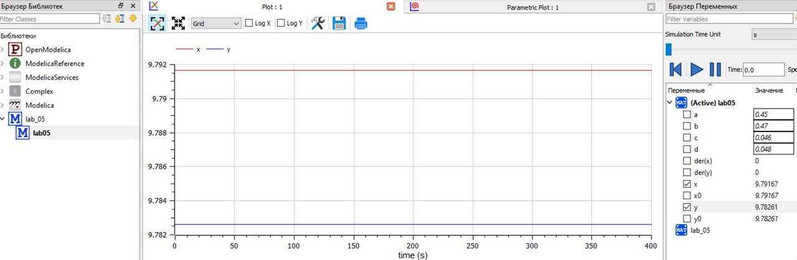

---
## Front matter
lang: ru-RU
title: "Лабораторная работа №5"
author: |
    Рыбалко Элина\inst{1}

institute: |
	\inst{1}RUDN University, Moscow, Russian Federation
  
date: 2022, 8 March, 2022 Murom, Russian Federation  

## Formatting
mainfont: PT Serif
romanfont: PT Serif
sansfont: PT Sans
monofont: PT Mono
toc: false
slide_level: 2
theme: metropolis
header-includes: 
 - \metroset{progressbar=frametitle,sectionpage=progressbar,numbering=fraction}
 - '\makeatletter'
 - '\beamer@ignorenonframefalse'
 - '\makeatother'
aspectratio: 43
section-titles: true
---

# Прагматика выполнения лабораторной работы 

 - Изучение основ математического моделирования.

 - Умение строить траектории движения в теории и визуализировать их.

# Цель выполнения лабораторной работы

Рассмотреть простейшую модель взаимодействия двух видов типа «хищник — жертва» - модель Лотки-Вольтерры.  

# Задачи выполнения лабораторной работы

Для модели «хищник-жертва»:  

  $$
  \left\{ 
  \begin{array}{c}
  \frac{\partial x}{\partial t} = -0,45x(t)+0,046x(t)y(t) \\ 
  \frac{\partial y}{\partial t} = 0,47y(t)-0,048x(t)y(t)
  \end{array}
  \right. 
  $$

  Построить график зависимости численности хищников от численности жертв, а также графики изменения численности хищников и численности жертв при следующих начальных условиях: $x_{0} = 7$, $y_{0} = 12$. Найти стационарное состояние системы. 

# Результат выполнения лабораторной работы

{ #fig:001} 

# Результат выполнения лабораторной работы

{ #fig:002} 

# Результат выполнения лабораторной работы 

{ #fig:003}  

# Результат выполнения лабораторной работы

{ #fig:004} 

# Вывод

Рассмотрели простейшую модель взаимодействия двух видов типа «хищник — жертва» - модель Лотки-Вольтерры. 