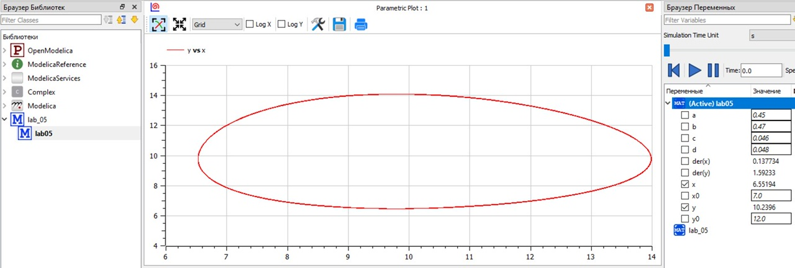
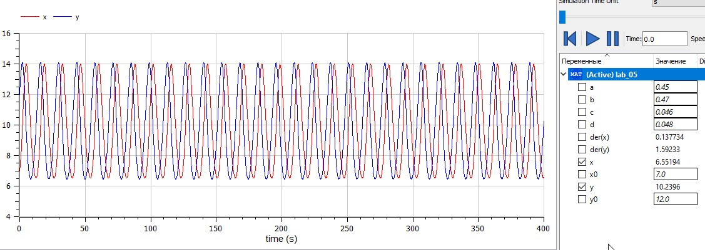
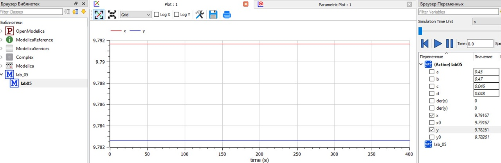
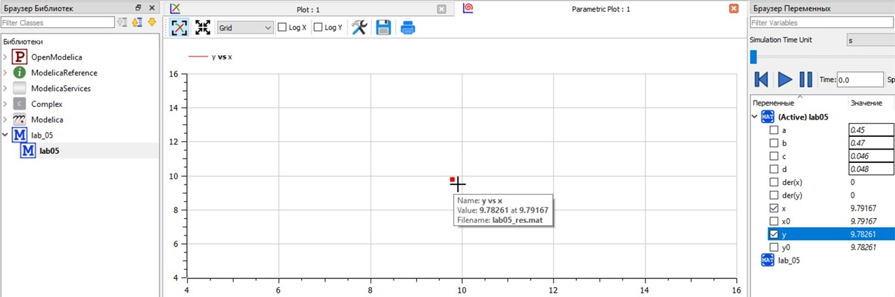

---
# Front matter
lang: ru-RU  
title: "Отчёт по лабораторной работе №5"  
subtitle: "дисциплина: Математическое моделирование"  
author: "Рыбалко Элина Павловна"  

# Generic otions
lang: ru-RU
toc-title: "Содержание"

# Bibliography
bibliography: bib/cite.bib
csl: pandoc/csl/gost-r-7-0-5-2008-numeric.csl

# Pdf output format
toc: true # Table of contents
toc_depth: 2
lof: true # List of figures
lot: true # List of tables
fontsize: 12pt
linestretch: 1.5
papersize: a4
documentclass: scrreprt
## I18n
polyglossia-lang:
  name: russian
  options:
  - spelling=modern
  - babelshorthands=true
polyglossia-otherlangs:
  name: english
### Fonts
mainfont: PT Serif
romanfont: PT Serif
sansfont: PT Sans
monofont: PT Mono
mainfontoptions: Ligatures=TeX
romanfontoptions: Ligatures=TeX
sansfontoptions: Ligatures=TeX,Scale=MatchLowercase
monofontoptions: Scale=MatchLowercase,Scale=0.9
## Biblatex
biblatex: true
biblio-style: "gost-numeric"
biblatexoptions:
  - parentracker=true
  - backend=biber
  - hyperref=auto
  - language=auto
  - autolang=other*
  - citestyle=gost-numeric
## Misc options
indent: true
header-includes:
  - \linepenalty=10 # the penalty added to the badness of each line within a paragraph (no associated penalty node) Increasing the value makes tex try to have fewer lines in the paragraph.
  - \interlinepenalty=0 # value of the penalty (node) added after each line of a paragraph.
  - \hyphenpenalty=50 # the penalty for line breaking at an automatically inserted hyphen
  - \exhyphenpenalty=50 # the penalty for line breaking at an explicit hyphen
  - \binoppenalty=700 # the penalty for breaking a line at a binary operator
  - \relpenalty=500 # the penalty for breaking a line at a relation
  - \clubpenalty=150 # extra penalty for breaking after first line of a paragraph
  - \widowpenalty=150 # extra penalty for breaking before last line of a paragraph
  - \displaywidowpenalty=50 # extra penalty for breaking before last line before a display math
  - \brokenpenalty=100 # extra penalty for page breaking after a hyphenated line
  - \predisplaypenalty=10000 # penalty for breaking before a display
  - \postdisplaypenalty=0 # penalty for breaking after a display
  - \floatingpenalty = 20000 # penalty for splitting an insertion (can only be split footnote in standard LaTeX)
  - \raggedbottom # or \flushbottom
  - \usepackage{float} # keep figures where there are in the text
  - \floatplacement{figure}{H} # keep figures where there are in the text
---

# Цель работы

Рассмотреть простейшую модель взаимодействия двух видов типа «хищник — жертва» - модель Лотки-Вольтерры.  

## Объект исследования

Модель взаимодействия двух видов типа «хищник — жертва».

## Предмет исследования

Алгоритм решения задачи о моделе взаимодействия двух видов типа «хищник — жертва».

# Теоретическое введение

Простейшая модель взаимодействия двух видов типа «хищник — жертва» - модель Лотки-Вольтерры. Данная двувидовая модель основывается на следующих предположениях:  
  1. Численность популяции жертв x и хищников y зависят только от времени (модель не учитывает пространственное распределение популяции на занимаемой территории)  
  2. В отсутствии взаимодействия численность видов изменяется по модели Мальтуса, при этом число жертв увеличивается, а число хищников падает  
  3. Естественная смертность жертвы и естественная рождаемость хищника считаются несущественными  
  4. Эффект насыщения численности обеих популяций не учитывается  
  5. Скорость роста численности жертв уменьшается пропорционально численности хищников:
 
$$
\left\{ 
\begin{array}{c}
\frac{\partial x}{\partial t} = ax(t)-bx(t)y(t) \\ 
\frac{\partial y}{\partial t} = -cy(t)+dx(t)y(t)
\end{array}
\right. 
$$

В этой модели x – число жертв, y - число хищников. Коэффициент a описывает скорость естественного прироста числа жертв в отсутствие хищников, с - естественное вымирание хищников, лишенных пищи в виде жертв. Вероятность
взаимодействия жертвы и хищника считается пропорциональной как количеству жертв, так и числу самих хищников (xy). Каждый акт взаимодействия уменьшает популяцию жертв, но способствует увеличению популяции хищников (члены -bxy
и dxy в правой части уравнения).  
Стационарное состояние системы (1) (положение равновесия, не зависящее от времени решение) будет в точке:
 
$$
\left\{ 
\begin{array}{c}
x_{0} = \frac{c}{d} \\ 
y_{0} = \frac{a}{b}
\end{array}
\right. 
$$[[1]](#список-литературы) 

# Задание

1. Построить график зависимости x от y и графики функций
x(t), y(t).
2. Найти стационарное состояние системы

# Выполнение лабораторной работы

## 1. Постановка задачи

**[Вариант 22]**

  Задача: Для модели «хищник-жертва»:  

  $$
  \left\{ 
  \begin{array}{c}
  \frac{\partial x}{\partial t} = -0,45x(t)+0,046x(t)y(t) \\ 
  \frac{\partial y}{\partial t} = 0,47y(t)-0,048x(t)y(t)
  \end{array}
  \right. 
  $$

  Постройте график зависимости численности хищников от численности жертв, а также графики изменения численности хищников и численности жертв при следующих начальных условиях: $x_{0} = 7$, $y_{0} = 12$. Найдите стационарное состояние системы.


## 2. Построение графиков 

### 2.1. Листинги программ в OpenModelica

1. Написала программу на Modelica:

Программа:

```
model lab05
  parameter Real a = 0.45; // коэффициент естественной смертности хищников
  parameter Real b = 0.47; // коэффициент естественного прироста жертв
  parameter Real c = 0.046; // коэффициент увеличения числа хищников 
  parameter Real d = 0.048; // коэффициент смертности жертв

  parameter Real x0 = 7; 
  parameter Real y0 = 12; //начальное значение x и у (популяция хищников и популяция жертв)

  //parameter Real x0 = b/d; 
  //parameter Real y0 = a/c; //стационарное состояние

  Real x(start=x0);
  Real y(start=y0);
equation
  der(x) = -a*x + c*x*y;
  der(y) = b*y - d*x*y;
end lab05;
 
```


### 2.2. Полученный график  

После запуска кода программы получили следующие графики для первого и второго случая соответственно  (см. рис. -@fig:001 и -@fig:002).

{ #fig:001} 

{ #fig:002} 

### 2.3. Стационарное состояние  

Стационарная система имеет вид (см. рис. -@fig:003 и -@fig:004 ).
Стационарная точка будет иметь коориднаты:

$$
\left\{ 
\begin{array}{c}
x_{0} = \frac{0.47}{0.048} \\ 
y_{0} = \frac{0.45}{0.046}
\end{array}
\right. 
$$

{ #fig:003}

{ #fig:004}

### 2.4. Анализ результатов:

Как можно заметить из рис. -@fig:001 с течением времени по мере роста числа жертв, будет возрастать число хищников. В определённый момент число жертв сокращается в силу роста числа хищников. Позднее начинается сокращаться число хищников из-за отсутствия добычи. И так по кругу.
Стационарное состояние остаётся неизменно в одной точке.

# Вывод

Рассмотрели простейшую модель взаимодействия двух видов типа «хищник — жертва» - модель Лотки-Вольтерры. 

# Список литературы {.unnumbered}

1. [Модель «хищник — жертва»](https://docviewer.yandex.ru/view/289699604/?page=9&*=jle%2FNAYm1edONQpKACbDfPz0iQV7InVybCI6Imh0dHBzOi8vYW5kam91cm5hbC5zZ3UucnUvc3lzdGVtL2ZpbGVzX2ZvcmNlL3RleHQtcGRmLzIwMTkvMDMvMjAxMW5vMnAwNjkucGRmP2Rvd25sb2FkPTEiLCJ0aXRsZSI6IjIwMTFubzJwMDY5LnBkZj9kb3dubG9hZD0xIiwibm9pZnJhbWUiOnRydWUsInVpZCI6IjI4OTY5OTYwNCIsInRzIjoxNjQ2NzU2MTM0MDE2LCJ5dSI6IjQzOTQ3OTQwNTE1OTYxNzgxMDQiLCJzZXJwUGFyYW1zIjoidG09MTY0Njc1NjEyNCZ0bGQ9cnUmbGFuZz1ydSZuYW1lPTIwMTFubzJwMDY5LnBkZj9kb3dubG9hZD0xJnRleHQ9JUQwJTlGJUQxJTgwJUQwJUJFJUQxJTgxJUQxJTgyJUQwJUI1JUQwJUI5JUQxJTg4JUQwJUIwJUQxJThGKyVEMCVCQyVEMCVCRSVEMCVCNCVEMCVCNSVEMCVCQiVEMSU4QyslRDAlQjIlRDAlQjclRDAlQjAlRDAlQjglRDAlQkMlRDAlQkUlRDAlQjQlRDAlQjUlRDAlQjklRDElODElRDElODIlRDAlQjIlRDAlQjglRDElOEYrJUQwJUI0JUQwJUIyJUQxJTgzJUQxJTg1KyVEMCVCMiVEMCVCOCVEMCVCNCVEMCVCRSVEMCVCMislRDElODIlRDAlQjglRDAlQkYlRDAlQjArJUMyJUFCJUQxJTg1JUQwJUI4JUQxJTg5JUQwJUJEJUQwJUI4JUQwJUJBKyVFMiU4MCU5NCslRDAlQjYlRDAlQjUlRDElODAlRDElODIlRDAlQjIlRDAlQjAlQzIlQkIrLSslRDAlQkMlRDAlQkUlRDAlQjQlRDAlQjUlRDAlQkIlRDElOEMrJUQwJTlCJUQwJUJFJUQxJTgyJUQwJUJBJUQwJUI4LSVEMCU5MiVEMCVCRSVEMCVCQiVEMSU4QyVEMSU4MiVEMCVCNSVEMSU4MCVEMSU4MCVEMSU4Qi4rJUQwJTk0JUQwJUIwJUQwJUJEJUQwJUJEJUQwJUIwJUQxJThGKyVEMCVCNCVEMCVCMiVEMSU4MyVEMCVCMiVEMCVCOCVEMCVCNCVEMCVCRSVEMCVCMiVEMCVCMCVEMSU4RislRDAlQkMlRDAlQkUlRDAlQjQlRDAlQjUlRDAlQkIlRDElOEMrJUQwJUJFJUQxJTgxJUQwJUJEJUQwJUJFJUQwJUIyJUQxJThCJUQwJUIyJUQwJUIwJUQwJUI1JUQxJTgyJUQxJTgxJUQxJThGKyVEMCVCRCVEMCVCMCslRDElODElRDAlQkIlRDAlQjUlRDAlQjQlRDElODMlRDElOEUlRDElODklRDAlQjglRDElODUrJUQwJUJGJUQxJTgwJUQwJUI1JUQwJUI0JUQwJUJGJUQwJUJFJUQwJUJCJUQwJUJFJUQwJUI2JUQwJUI1JUQwJUJEJUQwJUI4JUQxJThGJUQxJTg1JTNBKzEuKyVEMCVBNyVEMCVCOCVEMSU4MSVEMCVCQiVEMCVCNSVEMCVCRCVEMCVCRCVEMCVCRSVEMSU4MSVEMSU4MiVEMSU4QyslRDAlQkYlRDAlQkUlRDAlQkYlRDElODMlRDAlQkIlRDElOEYlRDElODYlRDAlQjglRDAlQjgrJUQwJUI2JUQwJUI1JUQxJTgwJUQxJTgyJUQwJUIyK3grJUQwJUI4KyVEMSU4NSVEMCVCOCVEMSU4OSVEMCVCRCVEMCVCOCVEMCVCQSVEMCVCRSVEMCVCMit5KyVEMCVCNyVEMCVCMCVEMCVCMiVEMCVCOCVEMSU4MSVEMSU4RiVEMSU4MislRDElODIlRDAlQkUlRDAlQkIlRDElOEMlRDAlQkElRDAlQkUrJUQwJUJFJUQxJTgyKyVEMCVCMiVEMSU4MCVEMCVCNSVEMCVCQyVEMCVCNSVEMCVCRCVEMCVCOCslMjglRDAlQkMlRDAlQkUlRDAlQjQlRDAlQjUlRDAlQkIlRDElOEMrJUQwJUJEJUQwJUI1KyVEMSU4MyVEMSU4NyVEMCVCOCVEMSU4MiVEMSU4QiVEMCVCMiZ1cmw9aHR0cHMlM0EvL2FuZGpvdXJuYWwuc2d1LnJ1L3N5c3RlbS9maWxlc19mb3JjZS90ZXh0LXBkZi8yMDE5LzAzLzIwMTFubzJwMDY5LnBkZiUzRmRvd25sb2FkJTNEMSZscj0xMDY2OCZtaW1lPXBkZiZsMTBuPXJ1JnNpZ249ODAzYmFmZmI3YzY1MmVhNzAxOGRjYWI1MzY2ZWE0NmUma2V5bm89MCJ9&lang=ru)
2. [Руководство по формуле Cmd Markdown](https://russianblogs.com/article/26051452570/)
3. [Математическое моделирование при решении задач](https://urok.1sept.ru/articles/609795)
4. [С.В. Каштаева, Математическое моделирование / Учебное пособие](http://pgsha.ru:8008/books/study/%CA%E0%F8%F2%E0%E5%E2%E0%20%D1.%20%C2.%20%CC%E0%F2%E5%EC%E0%F2%E8%F7%E5%F1%EA%EE%E5%20%EC%EE%E4%E5%EB%E8%F0%EE%E2%E0%ED%E8%E5..pdf)
5. [Руководство по оформлению Markdown файлов](https://gist.github.com/Jekins/2bf2d0638163f1294637)